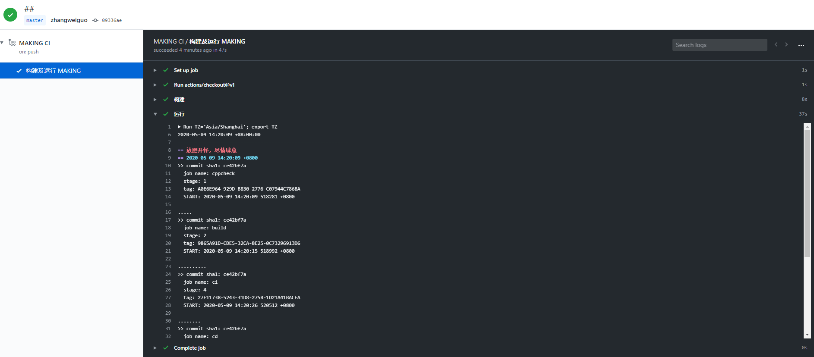

# get_started
 less is more


## 快速开始
需求:
- Windows 10 或 Ubuntu18.04
- Visual Studio 2015 Update 3 或更新的版本 (Windows 中)
- Git
- *可选:* CMake 3.10

如何开始:
```
> git clone https://github.com/byshift/get_started.git
> cd get_started
> cmake -H. -Bbuild && cmake --build ./build
```

## 运行
